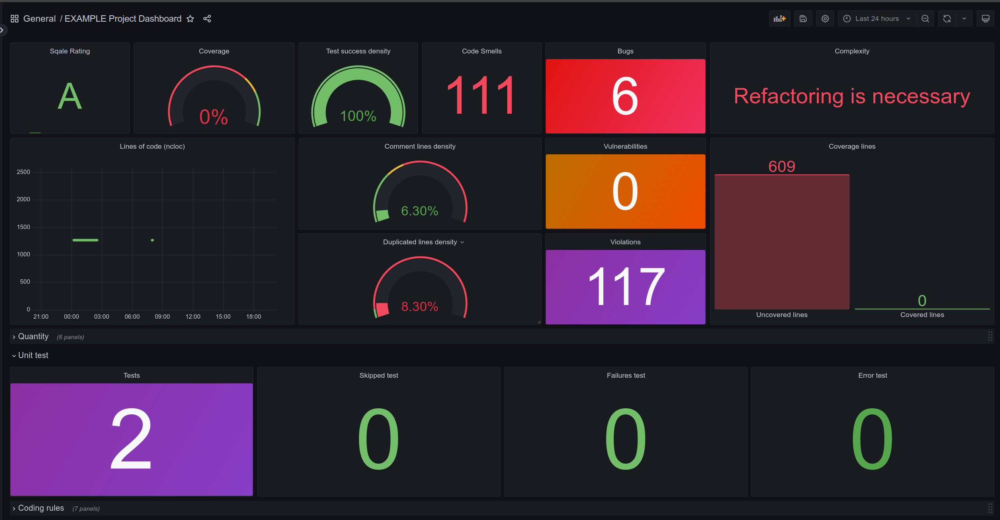

# CI-SonarQube-Metrics-Dashboard

This project sets up a dashboard to visualize SonarQube metrics using Prometheus, Grafana, and Jenkins. It provides a clear and interactive way to monitor code quality metrics from your CI/CD pipeline.



## Features

- **SonarQube Integration**: Fetches code quality metrics.
- **Prometheus Monitoring**: Scrapes metrics from SonarQube.
- **Grafana Visualization**: Displays metrics in an interactive dashboard.
- **Jenkins Automation**: Integrates with Jenkins for automated updates.

## Requirements

- docker & docker-compose
- envsubst command
- modify the .env values:

  ➡️ For an initial test, no modifications are needed.
  ➡️ Replace your_ngrok_token with the ngrok token you get from the official ngrok website.
  Important: the Docker container will not start if you do not enter this token, as it is necessary to authenticate the ngrok service.

## Deploying Docker Containers

If you're on Windows, I recommend using the Git Bash terminal. Make sure the Docker service is running.

1. **Clone the Repository**

   ```bash
   git clone https://github.com/Ioniva/CI-SonarQube-Metrics-Dashboard.git
   cd CI-SonarQube-Metrics-Dashboard

   ```

2. **Run the start-service script**

   ```bash
   # If you are going to use the ngrok service
   ./start-services.sh

   # If you are not going to use the ngrok service, run this command to skip checks:
   ./start-services.sh --skip "ngrok"
   ```

   You can check that the services are working by accessing their web interfaces:

   - **SonarQube**: [`http://localhost:9000`](http://localhost:9000)
   - **Prometheus**: [`http://localhost:9090`](http://localhost:9090)
   - **Grafana**: [`http://localhost:3000`](http://localhost:3000)

## Getting Started

### **Generating a User Token in SonarQube**

you have executed the script `./start-services.sh` and the services are running, follow these steps to generate a user token in SonarQube:

1. Access the SonarQube Instance:

   ➡️ http://localhost:9000

2. Log In to SonarQube:

   ➡️ Use the following credentials to log in:

   - **Username**: admin
   - **Password**: admin123 (or the password you defined in the `.env`)

3. Generate the User Token:

   ➡️ To create a new **user token**, go to: http://localhost:9000/account/security/.

### **Analyzing the Project**

For this example, we will analyze a project developed in Java using Maven. Follow these steps to analyze from the SonarQube server:

1. Run the Analysis from the Project:
   ```bash
      mvn clean verify sonar:sonar \
      -Dsonar.projectKey=your_project_key \
      -Dsonar.host.url=http://localhost:9000 \
      -Dsonar.login=your_sonar_token
   ```

### **Designing the Dashboard in Grafana**

1.  Access Grafana:

    ➡️ Open your browser and go to http://localhost:3000/login.

    Log in with the default credentials:

    - **Username**: admin
    - **Password**: admin

2.  Add a Data Source:
    - Navigate to the **Data Sources** section.
    - Click on **Add data source**.
    - Select **Prometheus** from the list of options.
    - Configure the following parameters:
      - **URL**: `http://prometheus:9090` (the URL of your Prometheus instance).
    - Adjust other settings as necessary for your environment.
3.  **Design the Dashboard**:
    - Go to the **Dashboard** tab in Grafana.
    - Use the available tools to create panels, graphs, and other visualizations.
    - Customize the layout and widgets to display the most relevant data for you.

## Applying Continuous Integration

To automate the workflow in a simple way, we will implement Jenkins in combination with GitHub (or any other version control system).

### **Ngrok**

Ngrok makes it easy to access local services through a dynamically generated public URL. This is ideal for accessing Jenkins, SonarQube, or other services in your development environment from anywhere on the Internet.

1.  Start the Container:

    ➡️ Once the container is running, Ngrok will generate a public URL for the Jenkins service.

2.  Find the Dynamic URL:

    - **From the Docker Logs Console**: Check the container logs to find the URL generated by Ngrok.
    - **From the Official Ngrok Page**: Go to the [**Endpoints**](https://dashboard.ngrok.com/cloud-edge/endpoints) section on the Ngrok website to view the public URL.

    **Note**: You must be registered on the official Ngrok website to use these services.

    **Remember**: Update the `.env` file with the Ngrok token to ensure proper integration

### **Setting Up Jenkins**

Once Jenkins is running, you can access the web interface to begin the initial configuration.

1.  Open Jenkins in the Browser:

    ➡️ Go to your instance URL: http://localhost:8080/

2.  Obtain Access Credentials:

    - **From the Docker Logs Console**: The admin credentials are generated when the container starts and are available in the logs.
    - **From the `initialAdminPassword` File**: Alternatively, you can find the initial password in the `secrets/initialAdminPassword` file within the `jenkins_home` volume, the location of which will depend on how you configured the volumes in Docker.

    **Note**: After logging in for the first time, you will be prompted to change the initial password.

### **Enable Remote Builds in Jenkins**

We will use the build-token-root plugin to trigger builds in Jenkins remotely. This plugin is already installed since it was included in the main directory structure. It allows builds to be initiated through a URI that is accessible by anonymous users, providing a valid token.

1.  **Create a New Job**:

    ➡️ Create a new job in Jenkins from the dashboard.

2.  **Configure the API Token**:

    ➡️ Within the job configuration, go to **Build Triggers**.

    ➡️ Enable the option **Trigger builds remotely (e.g., from scripts)**.

    ➡️ Enter a token in the provided field. **This token will be necessary to trigger the build remotely**.

3.  **Starting the Build Using the API:**

    ➡️ For simple jobs (without parameters):
    `http://localhost:8080/buildByToken/build?token=token123&job=JOB_NAME`

    ➡️ For jobs with parameters:
    `http://localhost:8080/buildByToken/buildWithParameters?token=token123&job=JOB_NAME&Branch=PARAMETER_VALUE`

    ➡️ For jobs with delay parameter (in seconds):
    `http://localhost:8080/buildByToken/buildWithParameters?token=token123&delay=300&job=JOB_NAME&Branch=PARAMETER_VALUE`

Now, you can customize the task according to your preferences and needs. For example, it can be configured to execute the Maven command each time this task is triggered.

### **GitHub Webhook**

To ensure that every commit on GitHub automatically triggers the continuous integration process in Jenkins, follow these steps to set up a webhook in your GitHub repository:

1.  **Access the Repository Settings**:

    ➡️ Go to your repository on GitHub and click on the **Settings** tab.

    ➡️ In the sidebar menu, select **Webhooks**.

2.  **Add a Webhook**

    ➡️ **Payload URL**: Enter the URL that will trigger the build in Jenkins. Use the public URL generated by Ngrok or a private domain, following the format: `http://<public_url>/job/JOB_NAME/build?token=TOKEN_NAME`.

    ➡️ **Content type**: Select `application/json`.

    ➡️ **Secret**: Optional; used to secure the webhook. You can leave it empty if no additional security is required.

    ➡️**Events**: Choose **Just the push event** to ensure the webhook is triggered only when a push is made.

    ➡️ **Active**: Make sure the webhook is activated.
    And now, every time a push is made to this repository, the task in Jenkins will be triggered 🎉.
